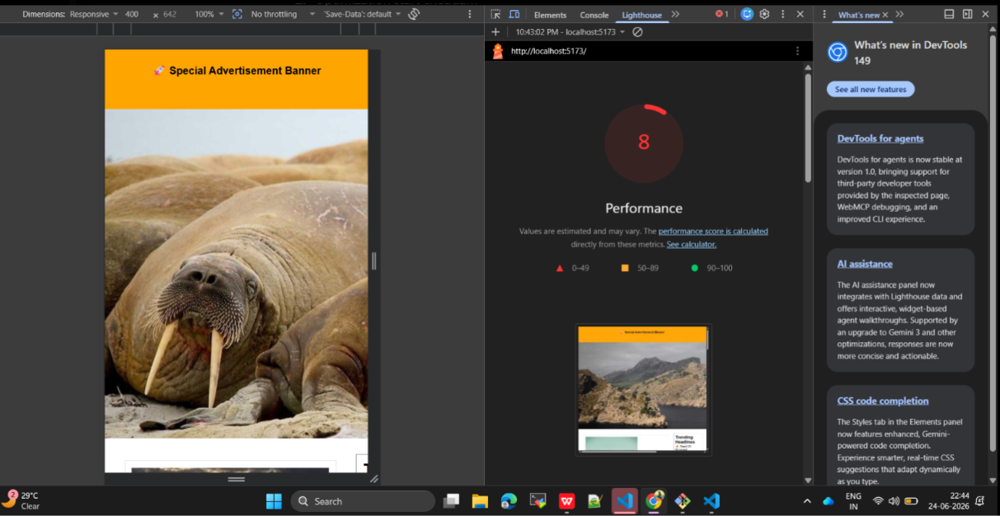
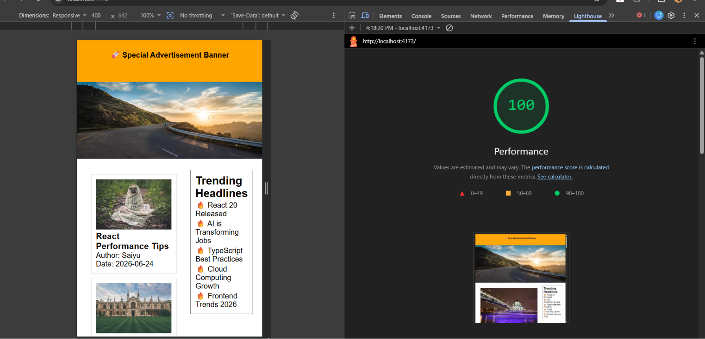
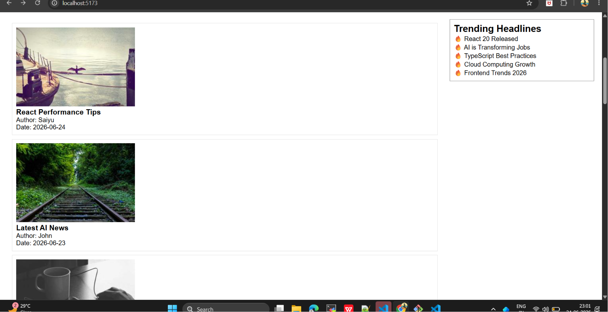

# 🚀 Frontend Performance Optimization using React + Core Web Vitals

## 📌 Project Overview

This project demonstrates how to identify, analyze, and optimize **Core Web Vitals (CWV)** in a React + TypeScript + Vite application.

The application was intentionally developed with several frontend performance issues to simulate a real-world scenario. These issues were analyzed using **Google Lighthouse** and then optimized using modern web performance best practices.

---

# 🎯 Main Objective

The main objective of this project is to improve the application's loading performance, responsiveness, and visual stability by optimizing Core Web Vitals.

### Performance Improvement

| Version             | Lighthouse Score |
| ------------------- | ---------------: |
| Before Optimization |            **8** |
| After Optimization  |          **100** |

---

# 🌟 Features

* Responsive React Application
* Hero Banner
* Article Cards
* Trending Sidebar
* Skeleton Loading
* Infinite Scroll
* Advertisement Banner
* Core Web Vitals Optimization
* Lighthouse Performance Testing
* Bundle Analysis

---

# 🛠️ Tech Stack

* React
* TypeScript
* Vite
* Web Vitals
* Google Lighthouse
* Rollup Plugin Visualizer
* Sharp CLI
* Lodash

---

# ⚡ Performance Optimizations

## 🖼️ Hero Image Optimization

* Converted PNG image to WebP
* Added image preload
* Added width and height attributes
* Used `fetchPriority="high"`
* Enabled async image decoding

---

## 🖼️ Image Optimization

* Added width & height attributes
* Lazy loaded article images
* Reduced layout shifts

---

## 📐 Layout Shift (CLS) Optimization

* Reserved advertisement banner space
* Eliminated unexpected page movement
* Improved visual stability

---

## ⚙️ JavaScript Optimization

* Removed heavy blocking tasks
* Deferred analytics initialization
* Reduced initial rendering delay

---

## 🔤 Font Optimization

* Added Google Fonts preconnect
* Implemented asynchronous font loading
* Enabled `display=swap`

---

## 📦 Bundle Optimization

* Installed Rollup Plugin Visualizer
* Generated bundle analysis report
* Optimized production bundle

---

# 📊 Lighthouse Results

| Metric      | Before |   After |
| ----------- | -----: | ------: |
| Performance |  **8** | **100** |

---

# 📷 Screenshots

## 🔴 Before Optimization



---

## 🟢 After Optimization



---

## 📈 Bundle Analysis Report



---

# 📦 Installation

## Clone Repository

```bash
git clone https://github.com/saiyasaswi-685/REACT-CWV-TASK.git
```

## Navigate to Project

```bash
cd REACT-CWV-TASK
```

## Install Dependencies

```bash
npm install
```

## Start Development Server

```bash
npm run dev
```

Open:

```
http://localhost:5173
```

---

# 🏗️ Production Build

Build the application

```bash
npm run build
```

Preview production build

```bash
npm run preview
```

Open:

```
http://localhost:4173
```

---

# 📥 NPM Packages Used

## Create React + Vite Project

```bash
npm create vite@latest
```

## Install Project Dependencies

```bash
npm install
```

## Install Web Vitals

```bash
npm install web-vitals
```

## Install Performance Optimization Tools

```bash
npm install sharp-cli rollup-plugin-visualizer --save-dev
```

---

# 🧪 Testing Guide

## Development Testing

```bash
npm run dev
```

Verify:

* Hero image loads correctly
* 12 article cards are displayed
* Sidebar is visible
* Skeleton loader appears
* Infinite scroll section loads
* Advertisement banner is displayed

---

## Production Build Testing

```bash
npm run build
```

Verify:

* Build completes successfully
* No build errors
* `bundle-stats.html` is generated

---

## Production Preview

```bash
npm run preview
```

Open:

```
http://localhost:4173
```

---

## Lighthouse Testing

1. Open Chrome
2. Press **F12**
3. Navigate to **Lighthouse**
4. Select:

* Desktop
* Performance

5. Click **Analyze page load**

### Expected Result

```
Performance Score = 100
```

---

## Bundle Analysis

After executing:

```bash
npm run build
```

A file named:

```
bundle-stats.html
```

is generated.

Open it in your browser to visualize the JavaScript bundle size and module distribution.

---

# 📂 Project Structure

```
REACT-CWV-TASK
│
├── public
│   ├── hero.png
│   ├── hero.webp
│   ├── favicon.svg
│   └── icons.svg
│
├── screenshots
│   ├── lighthouse-before.png
│   ├── lighthouse-after.png
│   └── bundle-analysis.png
│
├── src
│   ├── components
│   ├── data
│   ├── App.tsx
│   ├── main.tsx
│   └── reportVitals.ts
│
├── bundle-stats.html
├── README.md
├── package.json
├── vite.config.ts
└── .gitignore
```

---

# 👩‍💻 Author

**Saiyasaswi**

GitHub Profile:
https://github.com/saiyasaswi-685

Repository:
https://github.com/saiyasaswi-685/REACT-CWV-TASK

---

# 🏆 Final Result

✅ Successfully improved **Google Lighthouse Performance Score** from:

```
8  →  100
```

This project demonstrates practical implementation of modern frontend performance optimization techniques, including Core Web Vitals improvements, image optimization, bundle optimization, lazy loading, layout stability enhancements, and production performance analysis.
